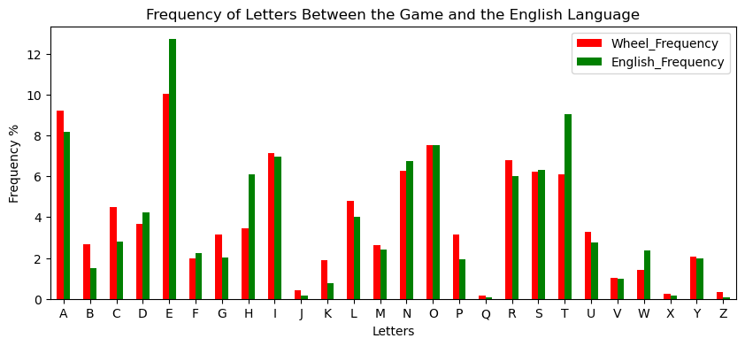
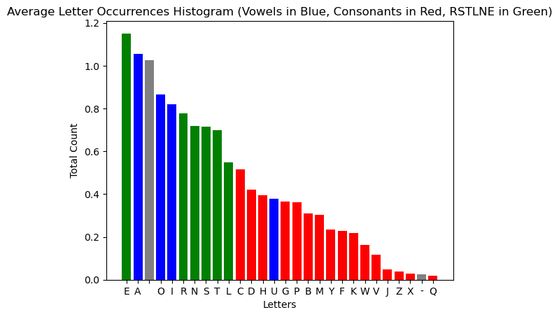
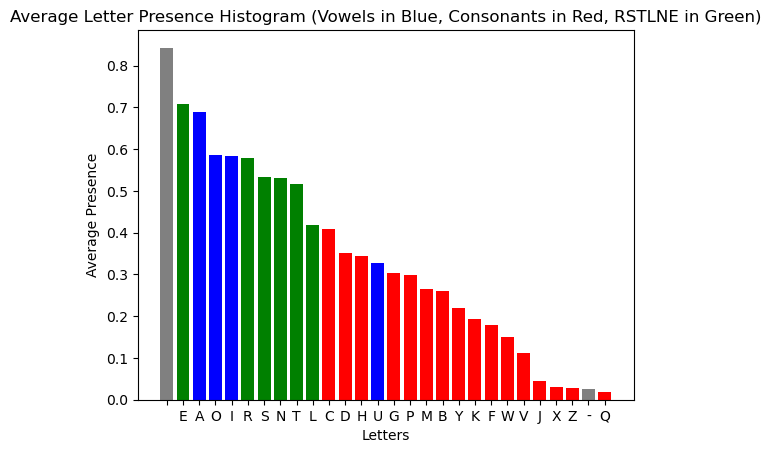
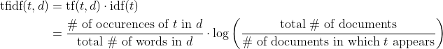
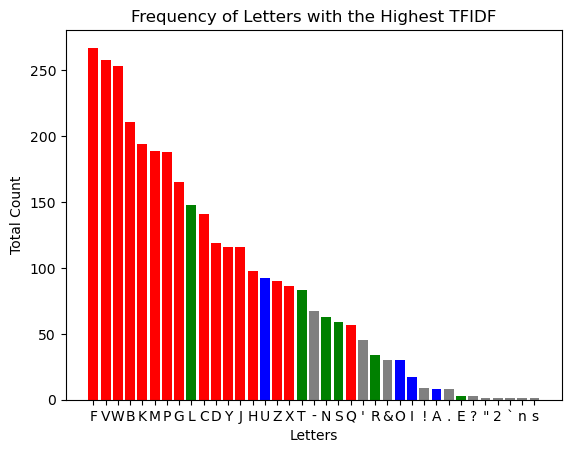

Wheel of Fortune is an American game show where contestants guess hidden phrases
by guessing letters one at a time. At the end of game, the contestant with the
highest amount of money gets to play the bonus round, where a challenging 
puzzle is presented with the letters `R`, `S`, `T`, `L`, `N`, and `E` are 
already shown. The contestant can choose 3 consonants and 1 vowel to help 
guess the phrase within a 10-second time frame.

Therefore, selecting the optimal letters gives the contestant the best chance of
solving the puzzle. This analysis aims to determine this set of letters in the 
general case.

## Methodology
This analysis took 3252 bonus puzzles (over 10 years) from the
[Bonus Puzzle Compendium](https://www.angelfire.com/mi4/malldirectories/wheel/wheelbonus.html).

## Frequency Analysis
The bonus round puzzles follow a different distribution of letters than the
typical distribution of letters in English.

Certain letters such as `E`, `T` and surprisingly `H` are underrepresented.
Most other letters are slightly more common in the puzzle than seen in English
corpus. Therefore, we can't just use the most common letters seen in English
language.

Here is the distribution of the average times a letter appears in the bonus round 
of Wheel of Fortune. For example, the letter `E` appears a little over 1.1 
times per round.

Here is the distribution of the average letter *presence* in the bonus round.
For example, the letter `E` is shown about 70% of rounds.

From these two graphs, we see that `C`, `D`, and `H` are the most common
consents and `A` the being the most common vowel, both in terms of occurrences 
and presence. We could stop here, but there is a small problem with choosing
only the most common letters.

## Deterministic Analysis
Consider the puzzle `ENERGY EFFICIENT`, which looks like `ENER__ E_____ENT` 
with `RSTLNE` filled in. Now look at the following result with specific letters
filled in:
- `G`: `ENERG_ E_____ENT`
- `Y`: `ENER_Y E_____ENT`
- `F`: `ENER__ EFF___ENT`
- `I`: `ENER__ E__I_IENT`
- `C`: `ENER__ E___C_ENT`

Although we discovered that `C` is the most common consonant from the prior 
analysis, it doesn't mean that it is the most helpful in solving the above 
puzzle. In my opinion, the letter `F` allows us to better deduce this 
particular solution due how it occurs twice and the fact that having a `F` 
is *rare*. Therefore, for this puzzle, `F` is more *important* than `C`.

So for every puzzle, how do we calculate the most important letters? One way
is to use TF-IDF (term frequency-inverse document frequency), a technique 
typically used to evaluate a word's relevance in a document compared to a set 
of documents. In the case of this analysis, letters will replace words and 
puzzles will replace documents.

For example, the TF-IDF of every letter in `ENERGY EFFICIENT` is:

|            |     F |     Y |     E |     N |     G |     I |     C |     T |     R |       |
|-----------:|------:|------:|------:|------:|------:|------:|------:|------:|------:|------:|
| **TF-IDF** | 0.215 | 0.095 | 0.087 | 0.079 | 0.074 | 0.067 | 0.056 | 0.041 | 0.034 | 0.011 |

As we assumed, `F` is the most relevant letter, followed by `Y` and `E`, 
respectively.

Now, we can count up the letters with the highest TF-IDF in the entire dataset,
of which we get the following distribution:

`F`, `V`, and `W` are the letters that the most frequent letters with the 
highest TF-IDF. Likewise, `U` is the most important vowel and `L` is the most
important given character. The most common consonants `C`, `D`, and `H` are 
middle of the pack when it comes to relevance. 

<iframe src="assets/top1_tf-idf_vs_frequency.html" width="800" height="600" frameborder="0"></iframe>

Here we see a negative correlation between how frequent letters show
up in a puzzle and how important the letter is in determining it. Although, 
`F`, `W`, and `V` are the most frequent important letters, they generally have 
low frequency, only present in less than 25% of puzzles each. On the other 
hand, the most common consonant, `C`, only appears to be highly important in a 
relatively low amount of puzzles (141), compared to `F` (267). This pattern is 
much more pronounced with vowels; `E`(3), `A`(8), `O`(30), `I`(17) are all much
more common than `U`, but don't even come close to how `U` defines its puzzles(92).

If we take the top 3 most important letters in a puzzle instead of the single 
most important letter, we get a slightly different result.

<iframe src="assets/top3_tf-idf_vs_frequency.html" width="800" height="600" frameborder="0"></iframe>

With the top 3 most important letters counted, `B`, `M`, and `P` now become the
most frequent important letters. They are also more commonly seen in puzzles 
than the previous `F`, `W`, and `V`.

Because of this, `B`, `M`, `P` and `U` are probabilistically the most helpful 
guesses a contestant can give in the final round. Other good consonants to
give are `P`, `G`, and `Y`. For a safer approach, one could stick with `C`, 
`H`, `D`, and any other vowel. 

Of course, these recommendations are for a general case. Every letter in every
puzzle will have their own unique TF-IDF score. In addition, this analysis did 
not consider factors which we may subconsciously take into account, such as
position and letter pairings. If you trust that there are patterns or factors 
that will increase your probability of solving a particular puzzle, they 
more-than-likely will, given the natural strength in language we all have. 
Trust your intuition. Enjoy the game.
